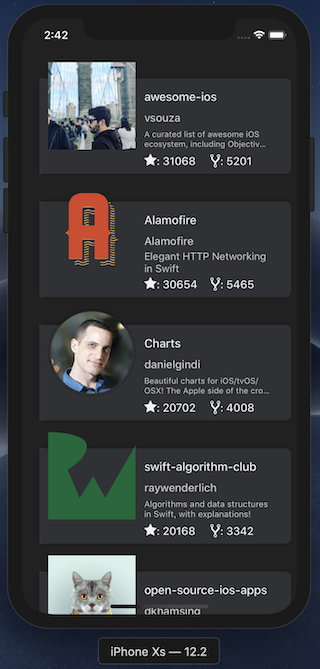

# GitHub for iOS

[](https://travis-ci.com/limadeveloper/GitHub)

iOS app to list the most popular GitHub repos ⭐️.



## Requirements

- Xcode 10.2+
- Swift 5.0+
- iOS 10.3+
- cocoapods

## Installation

If you don't have `bundler` installed in your machine, run the bellow command in your terminal:

```sh
gem install bundler
```

Next you need to install dependencies using cocoapods.

```sh
bundle install
bundle exec pod install --repo-update
```

If success, just run the project in Xcode 🎉.

## Dependencies

- [BaseNetworkKit](https://github.com/limadeveloper/BaseNetworkKit);
- [ObservableKit](https://github.com/limadeveloper/ObservableKit);
- [SwiftIconFont](https://github.com/0x73/SwiftIconFont);
- [SwiftLint](https://github.com/realm/SwiftLint);
- [Nimble](https://github.com/Quick/Nimble);
- [Quick](https://github.com/Quick/Quick);

## CI

This project has integration with [fastlane](https://fastlane.tools) and [Travis CI](https://travis-ci.com/limadeveloper/GitHub).  
So is it possible to run the project with a simple command in your terminal:

```sh
bundle exec fastlane build
```

This will run all tests and will generate some reports about `lint`, `coverage` and `tests`.

## Task Management

I like using [Trello](https://trello.com/b/S1WKcAj6) for task management.